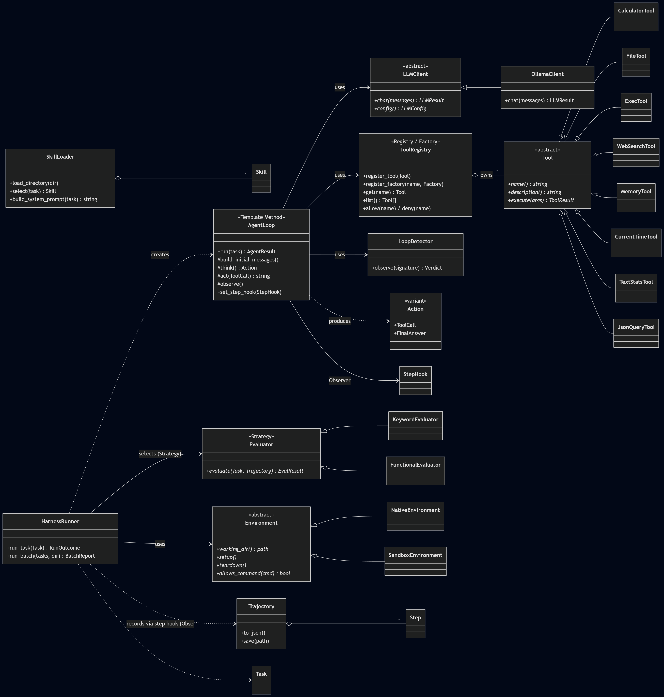
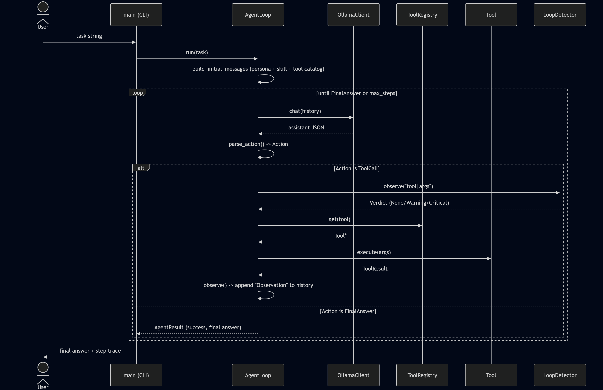
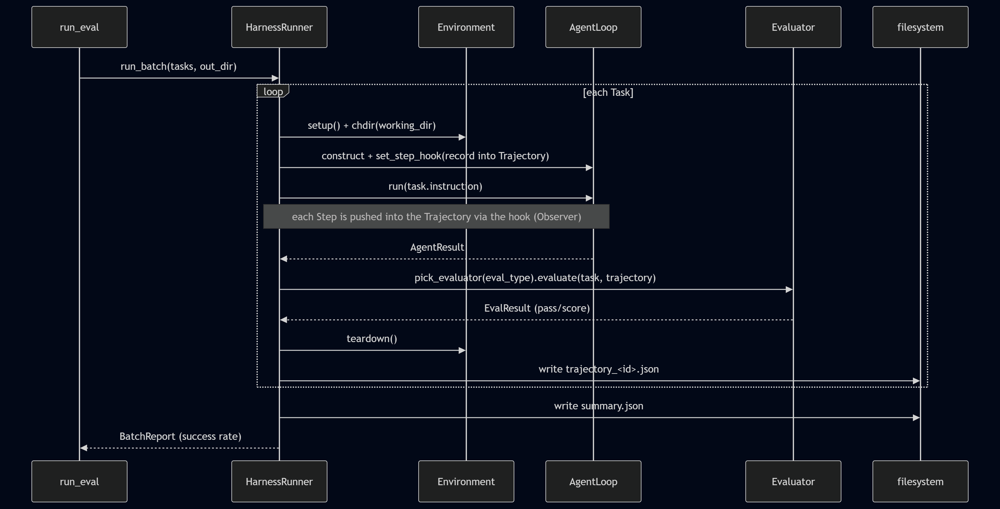
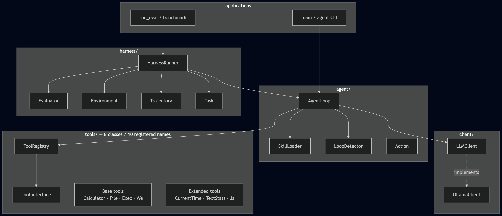

# Project Report — AI Agent Framework in C++

- **Student ID:** 25127136
- **Full name:** [YOUR FULL NAME]
- **Model:** gemma4 via local Ollama

## 1. Overview

This project implements an AI agent framework in modern C++ (C++17 → C++26) on top of a local
Ollama LLM. Rather than "call an API and print the answer", it is decomposed into independent,
testable object-oriented layers — an LLM client, a tool registry, a skill system, a ReAct agent
loop with loop detection, and an evaluation harness — that compose into a working agent.

The reference model is `gemma4` served by Ollama, but the design is provider-agnostic: switching
to OpenAI/Gemini is one new `LLMClient` subclass.

## 2. Architecture

The system is built as strictly layered modules; dependencies only ever point downward
(`apps → harness → agent → {client, tools}`). See [uml.md](uml.md) for the diagrams.

| Layer | Responsibility | Key types |
|-------|----------------|-----------|
| Client | HTTP + JSON to the model | `LLMClient` (abstract), `OllamaClient` |
| Tools | Capabilities the agent can invoke | Tools | Capabilities the agent can invoke | `Tool` (abstract) + 8 concrete classes / 10 registered names, `ToolRegistry` |
| Skills | Reusable prompt guidance | `SkillLoader`, `Skill` |
| Agent | The reasoning loop | `AgentLoop`, `LoopDetector`, `Action` |
| Harness | Measure + reproduce | `Trajectory`, `Evaluator`(s), `Environment`(s), `HarnessRunner` |

### 2.1 Extended tools

Besides the required base tools, the framework provides three additional tools
from three different categories:

| Tool | Category | Responsibility |
|---|---|---|
| `CurrentTimeTool` (`current_time`) | System utility | Obtains the current local date and time |
| `TextStatsTool` (`text_stats`) | Text processing | Counts characters, words, and lines |
| `JsonQueryTool` (`json_query`) | Structured data processing | Extracts a value from JSON using a dot-separated key path |

All three tools implement the common `Tool` interface, are registered through
`ToolRegistry`, and have deterministic unit tests.

### 2.2 Design invariants (deliberate decoupling)

- **`AgentLoop` does not know the harness exists.** It exposes a `StepHook`
  (`std::function<void(const Step&)>`); the harness subscribes to record a trajectory.
- **Tools do not depend on `AgentLoop`.** A tool only maps an argument string to a `ToolResult`.
- **Evaluators do not depend on how the agent ran** — they see only the finished `Trajectory`.
- **`LLMClient` is generic** — Ollama specifics live only in `OllamaClient`.

These invariants are what make each layer unit-testable in isolation.

### 2.3 UML diagrams

#### Whole-system class diagram



#### Agent-run sequence diagram



#### Harness batch sequence diagram



#### Component diagram




## 3. Design patterns

| Pattern | Realisation | Why |
|---------|-------------|-----|
| **Registry / Factory** | `ToolRegistry` registers tool instances or `name → factory` callbacks and creates them lazily | tools are added at runtime, not hardcoded |
| **Template Method** | `AgentLoop::run()` fixes the skeleton; `think()/act()/observe()` are overridable virtuals | the loop shape is invariant, the steps are customisable |
| **Strategy** | `Evaluator` → `KeywordEvaluator` / `FunctionalEvaluator`; `Environment` → `Native` / `Sandbox` | interchangeable judging / execution policies |
| **Observer / Hook** | `AgentLoop` emits each `Step` to a `StepHook`; `HarnessRunner` records the trajectory | decouples measurement from the loop |

## 4. Key implementation notes

- **Tool-call protocol.** The model is instructed to emit one JSON object
  `{"thought","action","action_input"}` per step. We parse it ourselves (`parse_action`) instead
  of relying on a provider's tool API: a balanced-brace scanner extracts the first `{...}` even
  when the model wraps it in prose or ``` fences.
- **`Action` as `std::variant<ToolCall, FinalAnswer>`** dispatched with `std::visit` + `if
  constexpr` — type-safe, no tag enums.
- **Loop detection.** Each action signature (`tool|args`) is fed to `LoopDetector`, which flags
  generic repeats and A/B ping-pong with Warning/Critical thresholds; Critical stops the run.
- **Error discipline.** `std::expected` (C++23) is used pervasively (`LLMResult`, `ToolResult`)
  so expected failures (timeouts, bad JSON, missing files) are values, not exceptions.
- **SQLite memory** uses prepared statements (`sqlite3_prepare_v2` + `sqlite3_bind_text`), so user
  input is never spliced into SQL — no injection surface.
- **RAII everywhere** — every `CURL*`, `FILE*`, `sqlite3*`/`stmt` is owned by a `unique_ptr` with
  a custom deleter, so no path leaks.

## 5. Harness & evaluation

`HarnessRunner` runs one or many `Task`s. For each: set up an `Environment` (workspace +
command policy), construct an `AgentLoop` with a step hook recording into a `Trajectory`, run,
then judge with the `Evaluator` named by the task's `eval_type`. Trajectories serialise to JSON
(brief §7.1); batch runs compute a **success rate** and a `summary.json`.
The deterministic test suite contains seven test executables. The latest verified
result is **7/7 tests passed (100%)**, including dedicated tests for all three
extended tools.

## 6. Benchmark results

The benchmark contains 10 tasks: 4 easy, 4 medium, and 2 hard. It exercises all
five base tool classes and both evaluator strategies.

**Final verified result on `gemma4`: 10/10 tasks passed (100%).**

| Metric | Result |
|---|---:|
| Total tasks | 10 |
| Passed | 10 |
| Total ReAct steps | 31 |
| Total tokens | 32,394 |
| Total execution time | 88,299 ms |
| Easy average | 2.5 steps |
| Medium average | 3.0 steps |
| Hard average | 4.5 steps |

The increasing average step count indicates that harder tasks require more
planning and tool sequencing. Task 006 explicitly exercises `web_search`, while
the hard tasks require up to five ReAct steps.

The three extended tools are verified by deterministic unit tests rather than
benchmark tasks. Therefore, this report does not claim that the benchmark
exercises every registered tool name.

Full trajectories and the generated summary are stored in
[`benchmark/sample_output/`](../benchmark/sample_output/). A detailed analysis,
including limitations and reproducibility notes, is available in
[benchmark-results.md](benchmark-results.md).

## 7. C++ techniques

At least 4× C++17, 2× C++20, 2× C++23, 1× C++26 are used — actual: 8/3/2/1. Highlights:
`std::unique_ptr` + custom deleters, abstract classes, `std::variant`/`std::visit`/`if
constexpr`, `std::filesystem`, structured bindings (C++17); designated initializers, `.contains`,
ranges (C++20); `std::expected`, `std::println` (C++23); `= delete("reason")` (C++26). Full map:
[cpp-features.md](cpp-features.md).

## 8. Difficulties encountered (and how they were solved)

1. **`std::println` link error on MinGW** (`undefined reference to std::__open_terminal`). The
   C++23 print unicode path lives in `libstdc++exp`; fixed by linking `stdc++exp`.
2. **`web_search` SSL failure** (`CURLE_SSL_CACERT_BADFILE`). The default MSYS2 CA bundle was a
   broken 0-byte symlink; the real 229 KB bundle was elsewhere. Added `resolve_ca_bundle()` that
   honours env overrides and probes known locations, accepting only a non-empty file.
3. **Functional evaluator failing on Windows.** `_popen` runs via `cmd /c`, which strips one outer
   quote pair, corrupting the `bash` path. Fixed by wrapping the whole command in an extra quote
   pair and using forward-slash temp paths.
4. **Nested-aggregate default argument.** `LoopDetector(Config config = {})` failed with
   "default member initializer required before the end of its enclosing class"; replaced with a
   defaulted no-arg constructor plus an explicit `Config` constructor.

## 9. Limitations & future work

- The 100% rate is specific to this suite and a low temperature; open-ended or longer-horizon
  tasks would lower it. Results are non-deterministic across runs.
- `SandboxEnvironment` isolation and the exec command policy are implemented and tested but the
  default benchmark uses `NativeEnvironment`.
- Bonus directions (not implemented): VLM/GUI agent, embedding-based vector memory, multi-agent
  coordination.

## 10. Demo video

YouTube Unlisted: `https://youtu.be/1Xn5-6cR6_8`

Github Link: `https://github.com/putindao/25127136_OopAgent`

The video demonstrates:

1. Building the project and running all seven tests.
2. Running an agent task with tool calling.
3. Demonstrating an extended tool.
4. Running the 10-task benchmark.
5. Inspecting `summary.json` and a trajectory file.
6. Explaining a design pattern and loop detection.

## 11. Conclusion

The project demonstrates that a non-trivial agent system can be expressed cleanly with classic
OOP: four design patterns, strict layering, and modern C++ idioms, verified end-to-end against a
real local LLM and a reproducible benchmark.
