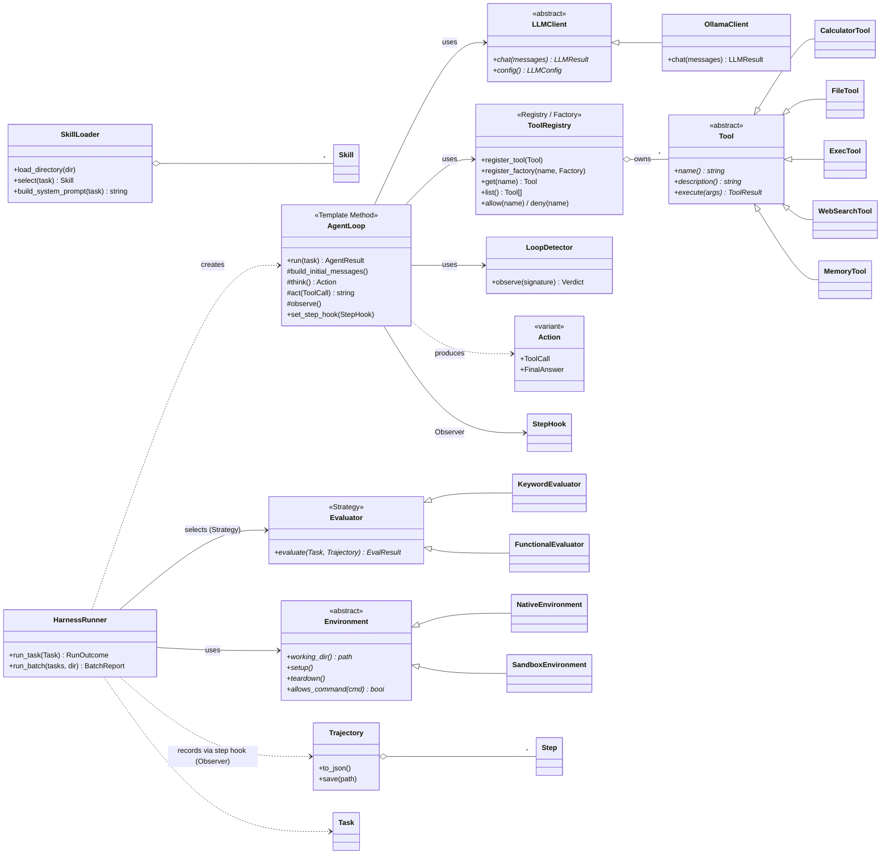
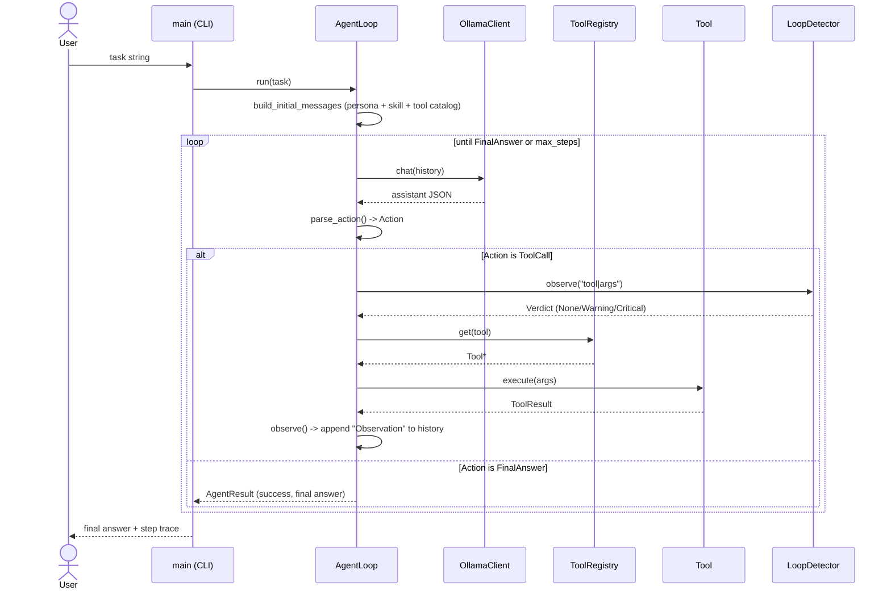
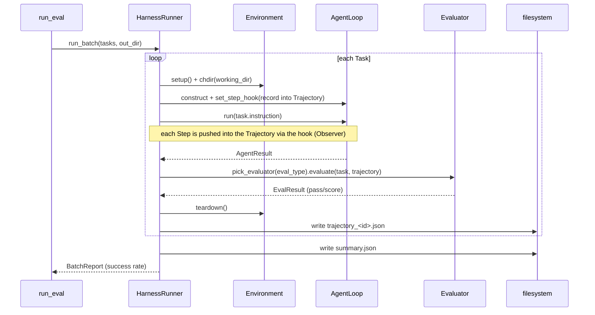
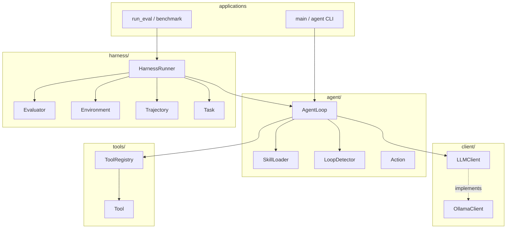

# UML Diagrams

Source diagrams in Mermaid. Render to PNG with the [Mermaid Live Editor](https://mermaid.live)
or the VS Code "Markdown Preview Mermaid" extension for the `docs/*.png` deliverables.

---

## 1. Class Diagram (whole system)

**Design invariants shown:** `AgentLoop` depends on `LLMClient` / `Tool` interfaces only — never
on `HarnessRunner`. The Harness reaches *down* into the agent via the `StepHook`, not the reverse.

---

## 2. Sequence — one complete agent run

---

## 3. Sequence — HarnessRunner batch evaluation

---

## 4. Component Diagram (modules + dependencies)

**Dependency direction is strictly downward:** `apps → harness → agent → {client, tools}`.
No lower layer ever includes a higher one.
